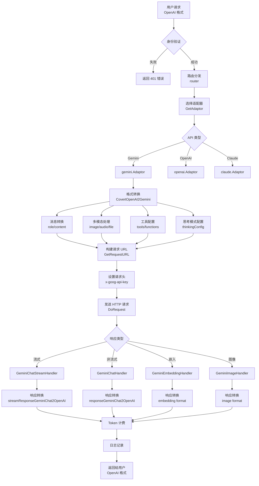

# New-API 连接 Gemini 详细指南

> **文档版本**: v1.0  
> **创建日期**: 2024-11-23  
> **作者**: Snow AI  
> **项目**: [New-API](https://github.com/Calcium-Ion/new-api)

---

## 📋 目录

- [架构概览](#架构概览)
- [连接步骤详解](#连接步骤详解)
  - [Step 1: 渠道配置](#step-1-渠道配置channel-configuration)
  - [Step 2: 适配器初始化](#step-2-适配器初始化adaptor-initialization)
  - [Step 3: 请求转换](#step-3-请求转换request-conversion)
  - [Step 4: 构建请求 URL](#step-4-构建请求-urlbuild-request-url)
  - [Step 5: 设置请求头](#step-5-设置请求头setup-request-headers)
  - [Step 6: 发送请求](#step-6-发送请求send-request)
  - [Step 7: 响应处理](#step-7-响应处理response-handling)
  - [Step 8: 响应转换](#step-8-响应转换response-conversion)
- [特殊功能实现](#特殊功能实现)
  - [思考模式](#a-思考模式thinking-mode)
  - [多模态支持](#b-多模态支持)
  - [工具调用](#c-工具调用function-calling)
  - [安全设置](#d-安全设置safety-settings)
- [完整请求流程图](#完整请求流程图)
- [Token 计费逻辑](#token-计费逻辑)
- [配置示例](#配置示例)
- [支持的 Gemini 模型](#支持的-gemini-模型)
- [核心优势](#核心优势)
- [总结](#总结)

---

## 🏗️ 架构概览

New-API 使用了 **适配器模式（Adapter Pattern）** 来统一处理不同 AI 提供商的 API，Gemini 的实现采用模块化设计，位于以下目录结构：

```
relay/
├── gemini_handler.go          # Gemini 请求处理主入口
├── relay_adaptor.go            # 适配器工厂（负责创建适配器实例）
└── channel/gemini/             # Gemini 专用实现模块
    ├── adaptor.go              # Gemini 适配器核心逻辑
    ├── relay-gemini.go         # OpenAI ↔ Gemini 格式转换
    ├── relay-gemini-native.go  # 原生 Gemini 格式支持
    └── constant.go             # 常量定义（模型列表、安全设置等）
```

### 关键组件说明

| 组件 | 职责 | 关键方法 |
|------|------|----------|
| **gemini_handler.go** | 请求路由和前置处理 | `GeminiHelper()`, `GeminiEmbeddingHandler()` |
| **adaptor.go** | 实现适配器接口 | `ConvertOpenAIRequest()`, `DoRequest()`, `DoResponse()` |
| **relay-gemini.go** | 格式转换核心 | `CovertOpenAI2Gemini()`, `responseGeminiChat2OpenAI()` |
| **relay-gemini-native.go** | 原生格式处理 | `GeminiTextGenerationHandler()` |

---

## 🔧 连接步骤详解

### Step 1: 渠道配置（Channel Configuration）

在 `constant/channel.go` 中定义了 Gemini 的渠道类型和基础配置：

```go
const (
    ChannelTypeGemini = 24  // Gemini 渠道标识符（唯一 ID）
)

var ChannelBaseURLs = []string{
    // ... 其他渠道的 Base URL
    "https://generativelanguage.googleapis.com", // Index 24: Gemini 默认 API 端点
}

var ChannelTypeNames = map[int]string{
    // ...
    ChannelTypeGemini: "Gemini",
}
```

**关键配置参数**：

| 参数 | 值 | 说明 |
|------|-----|------|
| **Base URL** | `https://generativelanguage.googleapis.com` | Gemini API 的官方端点 |
| **API Version** | `v1beta` / `v1` | 根据模型自动选择版本 |
| **API Key** | 通过请求头传递 | Header: `x-goog-api-key` |
| **Channel ID** | `24` | 在数据库中的渠道类型标识 |

---

### Step 2: 适配器初始化（Adaptor Initialization）

在 `relay/relay_adaptor.go` 中，根据 API 类型返回对应的适配器实例：

```go
func GetAdaptor(apiType int) Adaptor {
    switch apiType {
    case constant.APITypeOpenAI:
        return &openai.Adaptor{}
    case constant.APITypeAnthropic:
        return &claude.Adaptor{}
    case constant.APITypeGemini:
        return &gemini.Adaptor{}  // 返回 Gemini 适配器
    // ... 其他适配器
    default:
        return nil
    }
}
```

**适配器接口定义**：

```go
type Adaptor interface {
    // 请求转换
    ConvertOpenAIRequest(c *gin.Context, info *RelayInfo, request *dto.GeneralOpenAIRequest) (any, error)
    ConvertGeminiRequest(c *gin.Context, info *RelayInfo, request *dto.GeminiChatRequest) (any, error)
    
    // HTTP 请求处理
    GetRequestURL(info *RelayInfo) (string, error)
    SetupRequestHeader(c *gin.Context, req *http.Header, info *RelayInfo) error
    DoRequest(c *gin.Context, info *RelayInfo, requestBody io.Reader) (any, error)
    
    // 响应处理
    DoResponse(c *gin.Context, resp *http.Response, info *RelayInfo) (usage any, err *types.NewAPIError)
    
    // 元数据
    GetModelList() []string
    GetChannelName() string
}
```

---

### Step 3: 请求转换（Request Conversion）

**核心转换函数**：`CovertOpenAI2Gemini` （位于 `relay/channel/gemini/relay-gemini.go:186`）

这是 new-api 的关键创新，实现了 **OpenAI 格式 → Gemini API 格式** 的自动转换：

```go
func CovertOpenAI2Gemini(
    c *gin.Context, 
    textRequest dto.GeneralOpenAIRequest, 
    info *relaycommon.RelayInfo
) (*dto.GeminiChatRequest, error) {
    
    // 1. 初始化 Gemini 请求结构
    geminiRequest := dto.GeminiChatRequest{
        Contents: make([]dto.GeminiChatContent, 0, len(textRequest.Messages)),
        GenerationConfig: dto.GeminiChatGenerationConfig{
            Temperature:     textRequest.Temperature,
            TopP:            textRequest.TopP,
            MaxOutputTokens: textRequest.GetMaxTokens(),
            Seed:            int64(textRequest.Seed),
        },
    }
    
    // 2. 处理响应模态（文本 + 图像）
    if model_setting.IsGeminiModelSupportImagine(info.UpstreamModelName) {
        geminiRequest.GenerationConfig.ResponseModalities = []string{"TEXT", "IMAGE"}
    }
    
    // 3. 配置思考模式
    ThinkingAdaptor(&geminiRequest, info, textRequest)
    
    // 4. 设置安全过滤级别
    safetySettings := make([]dto.GeminiChatSafetySettings, 0)
    for _, category := range SafetySettingList {
        safetySettings = append(safetySettings, dto.GeminiChatSafetySettings{
            Category:  category,
            Threshold: model_setting.GetGeminiSafetySetting(category),
        })
    }
    geminiRequest.SafetySettings = safetySettings
    
    // 5. 转换消息内容（详细见下）
    // ...
    
    return &geminiRequest, nil
}
```

#### 详细转换内容

##### 5.1 消息角色映射

| OpenAI 角色 | Gemini 角色 | 说明 |
|-------------|------------|------|
| `system` | → `SystemInstructions` | 系统提示词独立字段 |
| `user` | → `user` | 用户消息（保持不变） |
| `assistant` | → `model` | 助手回复映射为模型回复 |
| `tool` / `function` | → `user` + `FunctionResponse` | 工具调用结果 |

**代码示例**：

```go
for _, message := range textRequest.Messages {
    if message.Role == "system" {
        // 系统消息单独处理
        system_content = append(system_content, message.StringContent())
        continue
    }
    
    content := dto.GeminiChatContent{
        Role: message.Role,
    }
    
    // 角色映射：assistant → model
    if content.Role == "assistant" {
        content.Role = "model"
    }
    
    // ... 处理消息内容
    geminiRequest.Contents = append(geminiRequest.Contents, content)
}

// 组装系统指令
if len(system_content) > 0 {
    geminiRequest.SystemInstructions = &dto.GeminiChatContent{
        Parts: []dto.GeminiPart{
            {Text: strings.Join(system_content, "\n")},
        },
    }
}
```

##### 5.2 多模态内容处理

**支持的内容类型**：

```go
type OpenAIMessageContent struct {
    Type     string  // "text", "image_url", "file", "input_audio"
    Text     string
    ImageURL *ImageURL
    File     *FileContent
    InputAudio *InputAudioContent
}
```

**图片处理逻辑**：

```go
for _, part := range openaiContent {
    if part.Type == dto.ContentTypeImageURL {
        imageNum++
        
        // 检查图片数量限制
        if constant.GeminiVisionMaxImageNum != -1 && 
           imageNum > constant.GeminiVisionMaxImageNum {
            return nil, fmt.Errorf("too many images, max allowed is %d", 
                constant.GeminiVisionMaxImageNum)
        }
        
        // 判断是 URL 还是 Base64
        if strings.HasPrefix(part.GetImageMedia().Url, "http") {
            // 下载 URL 并转换为 base64
            fileData, err := service.GetFileBase64FromUrl(
                c, 
                part.GetImageMedia().Url, 
                "formatting image for Gemini"
            )
            if err != nil {
                return nil, fmt.Errorf("get file from url failed: %w", err)
            }
            
            // 验证 MIME 类型白名单
            if _, ok := geminiSupportedMimeTypes[fileData.MimeType]; !ok {
                return nil, fmt.Errorf("unsupported mime type: %s", fileData.MimeType)
            }
            
            parts = append(parts, dto.GeminiPart{
                InlineData: &dto.GeminiInlineData{
                    MimeType: fileData.MimeType,
                    Data:     fileData.Base64Data,
                },
            })
        } else {
            // 解析 Base64 数据
            format, base64String, err := service.DecodeBase64FileData(
                part.GetImageMedia().Url
            )
            if err != nil {
                return nil, err
            }
            
            parts = append(parts, dto.GeminiPart{
                InlineData: &dto.GeminiInlineData{
                    MimeType: format,
                    Data:     base64String,
                },
            })
        }
    }
}
```

**支持的媒体类型白名单**：

```go
var geminiSupportedMimeTypes = map[string]bool{
    // 图片
    "image/png":  true,
    "image/jpeg": true,
    "image/webp": true,
    
    // 视频
    "video/mp4":  true,
    "video/mpeg": true,
    "video/mov":  true,
    "video/avi":  true,
    "video/wmv":  true,
    
    // 音频
    "audio/mp3":  true,
    "audio/mpeg": true,
    "audio/wav":  true,
    
    // 文档
    "application/pdf": true,
    "text/plain":      true,
}
```

##### 5.3 工具调用（Function Calling）转换

```go
if textRequest.Tools != nil {
    functions := make([]dto.FunctionRequest, 0, len(textRequest.Tools))
    googleSearch := false
    codeExecution := false
    urlContext := false
    
    for _, tool := range textRequest.Tools {
        // 处理特殊工具
        if tool.Function.Name == "googleSearch" {
            googleSearch = true
            continue
        }
        if tool.Function.Name == "codeExecution" {
            codeExecution = true
            continue
        }
        if tool.Function.Name == "urlContext" {
            urlContext = true
            continue
        }
        
        // 清理参数（移除 Gemini 不支持的字段）
        cleanedParams := cleanFunctionParameters(tool.Function.Parameters)
        tool.Function.Parameters = cleanedParams
        functions = append(functions, tool.Function)
    }
    
    // 组装 Gemini 工具列表
    geminiTools := geminiRequest.GetTools()
    if codeExecution {
        geminiTools = append(geminiTools, dto.GeminiChatTool{
            CodeExecution: make(map[string]string),
        })
    }
    if googleSearch {
        geminiTools = append(geminiTools, dto.GeminiChatTool{
            GoogleSearch: make(map[string]string),
        })
    }
    if urlContext {
        geminiTools = append(geminiTools, dto.GeminiChatTool{
            URLContext: make(map[string]string),
        })
    }
    if len(functions) > 0 {
        geminiTools = append(geminiTools, dto.GeminiChatTool{
            FunctionDeclarations: functions,
        })
    }
    
    geminiRequest.SetTools(geminiTools)
}
```

**参数清理函数**（移除 Gemini 不支持的 JSON Schema 字段）：

```go
func cleanFunctionParameters(params interface{}) interface{} {
    switch v := params.(type) {
    case map[string]interface{}:
        cleanedMap := make(map[string]interface{})
        for k, val := range v {
            cleanedMap[k] = val
        }
        
        // 移除不支持的字段
        delete(cleanedMap, "default")
        delete(cleanedMap, "exclusiveMaximum")
        delete(cleanedMap, "exclusiveMinimum")
        delete(cleanedMap, "$schema")
        delete(cleanedMap, "additionalProperties")
        
        // 递归清理嵌套结构
        if props, ok := cleanedMap["properties"].(map[string]interface{}); ok {
            for propName, propValue := range props {
                props[propName] = cleanFunctionParameters(propValue)
            }
        }
        
        return cleanedMap
    default:
        return params
    }
}
```

##### 5.4 响应格式（Response Format）

```go
if textRequest.ResponseFormat != nil && 
   (textRequest.ResponseFormat.Type == "json_schema" || 
    textRequest.ResponseFormat.Type == "json_object") {
    
    geminiRequest.GenerationConfig.ResponseMimeType = "application/json"
    
    if len(textRequest.ResponseFormat.JsonSchema) > 0 {
        var jsonSchema dto.FormatJsonSchema
        if err := common.Unmarshal(textRequest.ResponseFormat.JsonSchema, &jsonSchema); err == nil {
            // 清理 schema 中的不兼容字段
            cleanedSchema := removeAdditionalPropertiesWithDepth(jsonSchema.Schema, 0)
            geminiRequest.GenerationConfig.ResponseSchema = cleanedSchema
        }
    }
}
```

---

### Step 4: 构建请求 URL（Build Request URL）

在 `adaptor.go` 的 `GetRequestURL` 方法中动态构建 API 端点：

```go
func (a *Adaptor) GetRequestURL(info *relaycommon.RelayInfo) (string, error) {
    // 1. 处理思考模式后缀
    if model_setting.GetGeminiSettings().ThinkingAdapterEnabled &&
       !model_setting.ShouldPreserveThinkingSuffix(info.OriginModelName) {
        
        // 移除 -thinking-<budget> 格式
        if strings.Contains(info.UpstreamModelName, "-thinking-") {
            parts := strings.Split(info.UpstreamModelName, "-thinking-")
            info.UpstreamModelName = parts[0]
        } 
        // 移除 -thinking 后缀
        else if strings.HasSuffix(info.UpstreamModelName, "-thinking") {
            info.UpstreamModelName = strings.TrimSuffix(info.UpstreamModelName, "-thinking")
        } 
        // 移除 -nothinking 后缀
        else if strings.HasSuffix(info.UpstreamModelName, "-nothinking") {
            info.UpstreamModelName = strings.TrimSuffix(info.UpstreamModelName, "-nothinking")
        }
    }
    
    // 2. 获取 API 版本（v1 或 v1beta）
    version := model_setting.GetGeminiVersionSetting(info.UpstreamModelName)
    
    // 3. 图像生成模型（Imagen）
    if strings.HasPrefix(info.UpstreamModelName, "imagen") {
        return fmt.Sprintf("%s/%s/models/%s:predict", 
            info.ChannelBaseUrl, version, info.UpstreamModelName), nil
    }
    
    // 4. 嵌入模型
    if strings.HasPrefix(info.UpstreamModelName, "text-embedding") ||
       strings.HasPrefix(info.UpstreamModelName, "embedding") ||
       strings.HasPrefix(info.UpstreamModelName, "gemini-embedding") {
        
        action := "embedContent"
        if info.IsGeminiBatchEmbedding {
            action = "batchEmbedContents"
        }
        return fmt.Sprintf("%s/%s/models/%s:%s", 
            info.ChannelBaseUrl, version, info.UpstreamModelName, action), nil
    }
    
    // 5. 聊天完成模型
    action := "generateContent"
    if info.IsStream {
        action = "streamGenerateContent?alt=sse"
        if info.RelayMode == constant.RelayModeGemini {
            info.DisablePing = true  // 原生 Gemini 格式禁用心跳
        }
    }
    
    return fmt.Sprintf("%s/%s/models/%s:%s", 
        info.ChannelBaseUrl, version, info.UpstreamModelName, action), nil
}
```

**生成的 URL 示例**：

```bash
# 聊天完成（非流式）
https://generativelanguage.googleapis.com/v1beta/models/gemini-2.0-pro:generateContent

# 聊天完成（流式）
https://generativelanguage.googleapis.com/v1beta/models/gemini-2.0-pro:streamGenerateContent?alt=sse

# 嵌入（单文本）
https://generativelanguage.googleapis.com/v1beta/models/text-embedding-004:embedContent

# 嵌入（批量）
https://generativelanguage.googleapis.com/v1beta/models/text-embedding-004:batchEmbedContents

# 图像生成
https://generativelanguage.googleapis.com/v1beta/models/imagen-3.0-generate-002:predict
```

---

### Step 5: 设置请求头（Setup Request Headers）

```go
func (a *Adaptor) SetupRequestHeader(
    c *gin.Context, 
    req *http.Header, 
    info *relaycommon.RelayInfo
) error {
    // 设置通用请求头
    channel.SetupApiRequestHeader(info, c, req)
    
    // Gemini 专用：API Key 通过自定义头传递
    req.Set("x-goog-api-key", info.ApiKey)
    
    return nil
}
```

**完整请求头示例**：

```http
POST /v1beta/models/gemini-2.0-pro:generateContent HTTP/1.1
Host: generativelanguage.googleapis.com
Content-Type: application/json
x-goog-api-key: AIzaSy...（实际 API Key）
User-Agent: new-api/1.0
```

---

### Step 6: 发送请求（Send Request）

通过 `DoRequest` 方法发送 HTTP 请求：

```go
func (a *Adaptor) DoRequest(
    c *gin.Context, 
    info *relaycommon.RelayInfo, 
    requestBody io.Reader
) (any, error) {
    // 调用通用 API 请求处理器
    return channel.DoApiRequest(a, c, info, requestBody)
}
```

**完整 HTTP 请求示例**：

```http
POST https://generativelanguage.googleapis.com/v1beta/models/gemini-2.0-pro:generateContent
x-goog-api-key: AIzaSy...
Content-Type: application/json

{
  "contents": [
    {
      "role": "user",
      "parts": [
        {
          "text": "Hello, Gemini!"
        }
      ]
    }
  ],
  "generationConfig": {
    "temperature": 0.7,
    "topP": 0.9,
    "maxOutputTokens": 2048
  },
  "safetySettings": [
    {
      "category": "HARM_CATEGORY_HARASSMENT",
      "threshold": "BLOCK_NONE"
    },
    {
      "category": "HARM_CATEGORY_HATE_SPEECH",
      "threshold": "BLOCK_NONE"
    }
  ]
}
```

---

### Step 7: 响应处理（Response Handling）

根据响应类型分发到不同的处理器：

```go
func (a *Adaptor) DoResponse(
    c *gin.Context, 
    resp *http.Response, 
    info *relaycommon.RelayInfo
) (usage any, err *types.NewAPIError) {
    
    // 1. 原生 Gemini 格式模式
    if info.RelayMode == constant.RelayModeGemini {
        if strings.Contains(info.RequestURLPath, ":embedContent") ||
           strings.Contains(info.RequestURLPath, ":batchEmbedContents") {
            return NativeGeminiEmbeddingHandler(c, resp, info)
        }
        if info.IsStream {
            return GeminiTextGenerationStreamHandler(c, info, resp)
        } else {
            return GeminiTextGenerationHandler(c, info, resp)
        }
    }
    
    // 2. 图像生成（Imagen）
    if strings.HasPrefix(info.UpstreamModelName, "imagen") {
        return GeminiImageHandler(c, info, resp)
    }
    
    // 3. 嵌入模型
    if strings.HasPrefix(info.UpstreamModelName, "text-embedding") ||
       strings.HasPrefix(info.UpstreamModelName, "embedding") ||
       strings.HasPrefix(info.UpstreamModelName, "gemini-embedding") {
        return GeminiEmbeddingHandler(c, info, resp)
    }
    
    // 4. 聊天完成（OpenAI 格式）
    if info.IsStream {
        return GeminiChatStreamHandler(c, info, resp)
    } else {
        return GeminiChatHandler(c, info, resp)
    }
}
```

---

### Step 8: 响应转换（Response Conversion）

#### 8.1 非流式响应转换

**Gemini 响应结构**：

```go
type GeminiChatResponse struct {
    Candidates []struct {
        Index   int32
        Content GeminiChatContent
        FinishReason *string
    }
    UsageMetadata struct {
        PromptTokenCount     int
        CandidatesTokenCount int
        ThoughtsTokenCount   int
        TotalTokenCount      int
        PromptTokensDetails  []struct {
            Modality   string
            TokenCount int
        }
    }
}
```

**转换函数**：

```go
func responseGeminiChat2OpenAI(
    c *gin.Context, 
    response *dto.GeminiChatResponse
) *dto.OpenAITextResponse {
    
    fullTextResponse := dto.OpenAITextResponse{
        Id:      helper.GetResponseID(c),
        Object:  "chat.completion",
        Created: common.GetTimestamp(),
        Choices: make([]dto.OpenAITextResponseChoice, 0),
    }
    
    isToolCall := false
    
    for _, candidate := range response.Candidates {
        choice := dto.OpenAITextResponseChoice{
            Index: int(candidate.Index),
            Message: dto.Message{
                Role:    "assistant",
                Content: "",
            },
            FinishReason: constant.FinishReasonStop,
        }
        
        if len(candidate.Content.Parts) > 0 {
            var texts []string
            var toolCalls []dto.ToolCallResponse
            
            for _, part := range candidate.Content.Parts {
                // 处理内联数据（图片/音频/视频）
                if part.InlineData != nil {
                    if strings.HasPrefix(part.InlineData.MimeType, "image") {
                        imgText := ""
                        texts = append(texts, imgText)
                    } else {
                        texts = append(texts, fmt.Sprintf("[media](data:%s;base64,%s)", 
                            part.InlineData.MimeType, part.InlineData.Data))
                    }
                } 
                // 处理工具调用
                else if part.FunctionCall != nil {
                    choice.FinishReason = constant.FinishReasonToolCalls
                    if call := getResponseToolCall(&part); call != nil {
                        toolCalls = append(toolCalls, *call)
                    }
                } 
                // 处理思考内容
                else if part.Thought {
                    choice.Message.ReasoningContent = part.Text
                } 
                // 处理代码执行
                else {
                    if part.ExecutableCode != nil {
                        texts = append(texts, "```" + part.ExecutableCode.Language + 
                                       "\n" + part.ExecutableCode.Code + "\n```")
                    } else if part.CodeExecutionResult != nil {
                        texts = append(texts, "```output\n" + 
                                       part.CodeExecutionResult.Output + "\n```")
                    } else {
                        if part.Text != "\n" {
                            texts = append(texts, part.Text)
                        }
                    }
                }
            }
            
            if len(toolCalls) > 0 {
                choice.Message.SetToolCalls(toolCalls)
                isToolCall = true
            }
            choice.Message.SetStringContent(strings.Join(texts, "\n"))
        }
        
        // 转换 FinishReason
        if candidate.FinishReason != nil {
            switch *candidate.FinishReason {
            case "STOP":
                choice.FinishReason = constant.FinishReasonStop
            case "MAX_TOKENS":
                choice.FinishReason = constant.FinishReasonLength
            default:
                choice.FinishReason = constant.FinishReasonContentFilter
            }
        }
        
        if isToolCall {
            choice.FinishReason = constant.FinishReasonToolCalls
        }
        
        fullTextResponse.Choices = append(fullTextResponse.Choices, choice)
    }
    
    return &fullTextResponse
}
```

#### 8.2 流式响应转换

**SSE 流处理**：

```go
func GeminiChatStreamHandler(
    c *gin.Context, 
    info *relaycommon.RelayInfo, 
    resp *http.Response
) (*dto.Usage, *types.NewAPIError) {
    
    id := helper.GetResponseID(c)
    createAt := common.GetTimestamp()
    finishReason := constant.FinishReasonStop
    
    usage, err := geminiStreamHandler(c, info, resp, func(
        data string, 
        geminiResponse *dto.GeminiChatResponse
    ) bool {
        // 转换为 OpenAI 流式响应格式
        response, isStop := streamResponseGeminiChat2OpenAI(geminiResponse)
        
        response.Id = id
        response.Created = createAt
        response.Model = info.UpstreamModelName
        
        // 第一次响应：发送空响应头
        if info.SendResponseCount == 0 {
            emptyResponse := helper.GenerateStartEmptyResponse(
                id, createAt, info.UpstreamModelName, nil
            )
            
            // 处理工具调用的特殊逻辑
            if response.IsToolCall() {
                // 先发送工具调用框架
                if len(emptyResponse.Choices) > 0 && len(response.Choices) > 0 {
                    toolCalls := response.Choices[0].Delta.ToolCalls
                    copiedToolCalls := make([]dto.ToolCallResponse, len(toolCalls))
                    for idx := range toolCalls {
                        copiedToolCalls[idx] = toolCalls[idx]
                        copiedToolCalls[idx].Function.Arguments = ""
                    }
                    emptyResponse.Choices[0].Delta.ToolCalls = copiedToolCalls
                }
                finishReason = constant.FinishReasonToolCalls
                handleStream(c, info, emptyResponse)
                
                response.ClearToolCalls()
                if response.IsFinished() {
                    response.Choices[0].FinishReason = nil
                }
            } else {
                handleStream(c, info, emptyResponse)
            }
        }
        
        // 发送实际内容
        handleStream(c, info, response)
        
        // 发送结束标记
        if isStop {
            handleStream(c, info, helper.GenerateStopResponse(
                id, createAt, info.UpstreamModelName, finishReason
            ))
        }
        
        return true
    })
    
    if err != nil {
        return usage, err
    }
    
    // 发送最终使用量统计
    response := helper.GenerateFinalUsageResponse(id, createAt, info.UpstreamModelName, *usage)
    handleFinalStream(c, info, response)
    
    return usage, nil
}
```

**流式响应格式示例**：

```
data: {"id":"chatcmpl-123","object":"chat.completion.chunk","created":1234567890,"model":"gemini-2.0-pro","choices":[{"index":0,"delta":{"role":"assistant"},"finish_reason":null}]}

data: {"id":"chatcmpl-123","object":"chat.completion.chunk","created":1234567890,"model":"gemini-2.0-pro","choices":[{"index":0,"delta":{"content":"Hello"},"finish_reason":null}]}

data: {"id":"chatcmpl-123","object":"chat.completion.chunk","created":1234567890,"model":"gemini-2.0-pro","choices":[{"index":0,"delta":{"content":"!"},"finish_reason":null}]}

data: {"id":"chatcmpl-123","object":"chat.completion.chunk","created":1234567890,"model":"gemini-2.0-pro","choices":[{"index":0,"delta":{},"finish_reason":"stop"}]}

data: {"id":"chatcmpl-123","object":"chat.completion.chunk","created":1234567890,"model":"gemini-2.0-pro","choices":[],"usage":{"prompt_tokens":10,"completion_tokens":5,"total_tokens":15}}

data: [DONE]
```

---

## 🎯 特殊功能实现

### A. 思考模式（Thinking Mode）

New-API 通过模型名称后缀实现了对 Gemini 思考模式的灵活控制：

#### 支持的后缀格式

| 后缀格式 | 说明 | 示例 |
|---------|------|------|
| `-thinking` | 启用思考模式（自动计算预算） | `gemini-2.5-pro-thinking` |
| `-thinking-<number>` | 启用思考模式（指定预算） | `gemini-2.5-pro-thinking-256` |
| `-nothinking` | 强制禁用思考模式 | `gemini-2.5-flash-nothinking` |

#### 实现逻辑

```go
func ThinkingAdaptor(
    geminiRequest *dto.GeminiChatRequest, 
    info *relaycommon.RelayInfo, 
    oaiRequest ...dto.GeneralOpenAIRequest
) {
    if !model_setting.GetGeminiSettings().ThinkingAdapterEnabled {
        return  // 思考适配器未启用
    }
    
    modelName := info.UpstreamModelName
    
    // 1. 处理 -thinking-<budget> 格式（精确预算）
    if strings.Contains(modelName, "-thinking-") {
        parts := strings.SplitN(modelName, "-thinking-", 2)
        if len(parts) == 2 && parts[1] != "" {
            if budgetTokens, err := strconv.Atoi(parts[1]); err == nil {
                clampedBudget := clampThinkingBudget(modelName, budgetTokens)
                geminiRequest.GenerationConfig.ThinkingConfig = &dto.GeminiThinkingConfig{
                    ThinkingBudget:  common.GetPointer(clampedBudget),
                    IncludeThoughts: true,
                }
            }
        }
    } 
    // 2. 处理 -thinking 后缀（自动预算）
    else if strings.HasSuffix(modelName, "-thinking") {
        geminiRequest.GenerationConfig.ThinkingConfig = &dto.GeminiThinkingConfig{
            IncludeThoughts: true,
        }
        
        // 如果设置了 MaxOutputTokens，计算思考预算
        if geminiRequest.GenerationConfig.MaxOutputTokens > 0 {
            percentage := model_setting.GetGeminiSettings().ThinkingAdapterBudgetTokensPercentage
            budgetTokens := percentage * float64(geminiRequest.GenerationConfig.MaxOutputTokens)
            clampedBudget := clampThinkingBudget(modelName, int(budgetTokens))
            geminiRequest.GenerationConfig.ThinkingConfig.ThinkingBudget = common.GetPointer(clampedBudget)
        } else if len(oaiRequest) > 0 {
            // 根据 reasoning_effort 参数设置预算
            geminiRequest.GenerationConfig.ThinkingConfig.ThinkingBudget = 
                common.GetPointer(clampThinkingBudgetByEffort(modelName, oaiRequest[0].ReasoningEffort))
        }
    } 
    // 3. 处理 -nothinking 后缀（强制禁用）
    else if strings.HasSuffix(modelName, "-nothinking") {
        if !isNew25ProModel(modelName) {
            geminiRequest.GenerationConfig.ThinkingConfig = &dto.GeminiThinkingConfig{
                ThinkingBudget: common.GetPointer(0),
            }
        }
    }
}
```

#### 预算限制（Budget Clamping）

不同模型有不同的思考预算范围：

```go
const (
    pro25MinBudget       = 128    // Gemini 2.5 Pro 最小预算
    pro25MaxBudget       = 32768  // Gemini 2.5 Pro 最大预算
    flash25MaxBudget     = 24576  // Gemini 2.5 Flash 最大预算
    flash25LiteMinBudget = 512    // Gemini 2.5 Flash Lite 最小预算
    flash25LiteMaxBudget = 24576  // Gemini 2.5 Flash Lite 最大预算
)

func clampThinkingBudget(modelName string, budget int) int {
    isNew25Pro := isNew25ProModel(modelName)
    is25FlashLite := is25FlashLiteModel(modelName)
    
    if is25FlashLite {
        if budget < flash25LiteMinBudget {
            return flash25LiteMinBudget
        }
        if budget > flash25LiteMaxBudget {
            return flash25LiteMaxBudget
        }
    } else if isNew25Pro {
        if budget < pro25MinBudget {
            return pro25MinBudget
        }
        if budget > pro25MaxBudget {
            return pro25MaxBudget
        }
    } else {
        if budget < 0 {
            return 0
        }
        if budget > flash25MaxBudget {
            return flash25MaxBudget
        }
    }
    
    return budget
}
```

#### 使用示例

**示例 1：启用思考模式（自动预算）**

```json
{
  "model": "gemini-2.5-pro-thinking",
  "messages": [
    {
      "role": "user",
      "content": "解决这个复杂的数学问题：..."
    }
  ],
  "max_tokens": 4096
}
```

转换后的 Gemini 请求会包含：

```json
{
  "generationConfig": {
    "thinkingConfig": {
      "includethoughts": true,
      "thinkingBudget": 2048
    }
  }
}
```

**示例 2：指定思考预算**

```json
{
  "model": "gemini-2.5-pro-thinking-512",
  "messages": [...]
}
```

转换后：

```json
{
  "generationConfig": {
    "thinkingConfig": {
      "includethoughts": true,
      "thinkingBudget": 512
    }
  }
}
```

**示例 3：禁用思考模式**

```json
{
  "model": "gemini-2.5-flash-nothinking",
  "messages": [...]
}
```

转换后：

```json
{
  "generationConfig": {
    "thinkingConfig": {
      "thinkingBudget": 0
    }
  }
}
```

---

### B. 多模态支持

#### 支持的媒体类型

New-API 实现了完整的多模态支持，能够自动处理各种媒体格式：

```go
var geminiSupportedMimeTypes = map[string]bool{
    // 图片格式
    "image/png":  true,
    "image/jpeg": true,
    "image/webp": true,
    
    // 视频格式
    "video/mp4":    true,
    "video/mpeg":   true,
    "video/mov":    true,
    "video/avi":    true,
    "video/wmv":    true,
    "video/mpegps": true,
    "video/flv":    true,
    
    // 音频格式
    "audio/mp3":  true,
    "audio/mpeg": true,
    "audio/wav":  true,
    
    // 文档格式
    "application/pdf": true,
    "text/plain":      true,
}
```

#### 图片处理

**支持两种图片输入方式**：

1. **URL 方式**：

```json
{
  "model": "gemini-1.5-pro",
  "messages": [
    {
      "role": "user",
      "content": [
        {"type": "text", "text": "描述这张图片"},
        {"type": "image_url", "image_url": {"url": "https://example.com/image.jpg"}}
      ]
    }
  ]
}
```

**处理流程**：

```go
if strings.HasPrefix(part.GetImageMedia().Url, "http") {
    // 1. 下载图片
    fileData, err := service.GetFileBase64FromUrl(
        c, 
        part.GetImageMedia().Url, 
        "formatting image for Gemini"
    )
    if err != nil {
        return nil, fmt.Errorf("get file from url failed: %w", err)
    }
    
    // 2. 验证 MIME 类型
    if _, ok := geminiSupportedMimeTypes[strings.ToLower(fileData.MimeType)]; !ok {
        return nil, fmt.Errorf("unsupported mime type: %s", fileData.MimeType)
    }
    
    // 3. 转换为 Gemini 格式
    parts = append(parts, dto.GeminiPart{
        InlineData: &dto.GeminiInlineData{
            MimeType: fileData.MimeType,
            Data:     fileData.Base64Data,  // Base64 编码
        },
    })
}
```

2. **Base64 方式**：

```json
{
  "model": "gemini-1.5-pro",
  "messages": [
    {
      "role": "user",
      "content": [
        {"type": "text", "text": "描述这张图片"},
        {"type": "image_url", "image_url": {"url": "data:image/jpeg;base64,/9j/4AAQSkZJRg..."}}
      ]
    }
  ]
}
```

**处理流程**：

```go
else {
    // 解析 Base64 数据
    format, base64String, err := service.DecodeBase64FileData(
        part.GetImageMedia().Url
    )
    if err != nil {
        return nil, fmt.Errorf("decode base64 image failed: %w", err)
    }
    
    parts = append(parts, dto.GeminiPart{
        InlineData: &dto.GeminiInlineData{
            MimeType: format,        // 例如：image/jpeg
            Data:     base64String,  // 纯 Base64 数据
        },
    })
}
```

#### 音频处理

```go
if part.Type == dto.ContentTypeInputAudio {
    if part.GetInputAudio().Data == "" {
        return nil, fmt.Errorf("only base64 audio is supported")
    }
    
    base64String, err := service.DecodeBase64AudioData(part.GetInputAudio().Data)
    if err != nil {
        return nil, fmt.Errorf("decode base64 audio failed: %w", err)
    }
    
    parts = append(parts, dto.GeminiPart{
        InlineData: &dto.GeminiInlineData{
            MimeType: "audio/" + part.GetInputAudio().Format,  // 例如：audio/mp3
            Data:     base64String,
        },
    })
}
```

#### 文件处理

```go
if part.Type == dto.ContentTypeFile {
    if part.GetFile().FileId != "" {
        return nil, fmt.Errorf("only base64 file is supported in gemini")
    }
    
    format, base64String, err := service.DecodeBase64FileData(part.GetFile().FileData)
    if err != nil {
        return nil, fmt.Errorf("decode base64 file failed: %w", err)
    }
    
    parts = append(parts, dto.GeminiPart{
        InlineData: &dto.GeminiInlineData{
            MimeType: format,
            Data:     base64String,
        },
    })
}
```

#### 图片数量限制

```go
imageNum := 0
for _, part := range openaiContent {
    if part.Type == dto.ContentTypeImageURL {
        imageNum++
        
        // 检查是否超过限制（默认 16 张）
        if constant.GeminiVisionMaxImageNum != -1 && 
           imageNum > constant.GeminiVisionMaxImageNum {
            return nil, fmt.Errorf(
                "too many images in the message, max allowed is %d", 
                constant.GeminiVisionMaxImageNum
            )
        }
        
        // ... 处理图片
    }
}
```

**配置限制**：

```bash
# .env 文件
GEMINI_VISION_MAX_IMAGE_NUM=16  # 最多 16 张图片
```

---

### C. 工具调用（Function Calling）

#### 工具类型

New-API 支持三种工具类型：

1. **标准函数工具**（用户自定义）
2. **Google Search**（内置工具）
3. **Code Execution**（代码执行）
4. **URL Context**（URL 上下文）

#### 转换逻辑

```go
if textRequest.Tools != nil {
    functions := make([]dto.FunctionRequest, 0, len(textRequest.Tools))
    googleSearch := false
    codeExecution := false
    urlContext := false
    
    for _, tool := range textRequest.Tools {
        // 识别特殊工具
        switch tool.Function.Name {
        case "googleSearch":
            googleSearch = true
            continue
        case "codeExecution":
            codeExecution = true
            continue
        case "urlContext":
            urlContext = true
            continue
        default:
            // 清理参数（移除 Gemini 不支持的 JSON Schema 字段）
            if tool.Function.Parameters != nil {
                params, ok := tool.Function.Parameters.(map[string]interface{})
                if ok {
                    if props, hasProps := params["properties"].(map[string]interface{}); hasProps {
                        if len(props) == 0 {
                            tool.Function.Parameters = nil
                        }
                    }
                }
            }
            
            cleanedParams := cleanFunctionParameters(tool.Function.Parameters)
            tool.Function.Parameters = cleanedParams
            functions = append(functions, tool.Function)
        }
    }
    
    // 组装 Gemini 工具列表
    geminiTools := geminiRequest.GetTools()
    
    if codeExecution {
        geminiTools = append(geminiTools, dto.GeminiChatTool{
            CodeExecution: make(map[string]string),
        })
    }
    
    if googleSearch {
        geminiTools = append(geminiTools, dto.GeminiChatTool{
            GoogleSearch: make(map[string]string),
        })
    }
    
    if urlContext {
        geminiTools = append(geminiTools, dto.GeminiChatTool{
            URLContext: make(map[string]string),
        })
    }
    
    if len(functions) > 0 {
        geminiTools = append(geminiTools, dto.GeminiChatTool{
            FunctionDeclarations: functions,
        })
    }
    
    geminiRequest.SetTools(geminiTools)
}
```

#### 使用示例

**示例 1：标准函数工具**

```json
{
  "model": "gemini-2.0-pro",
  "messages": [
    {"role": "user", "content": "今天北京天气如何？"}
  ],
  "tools": [
    {
      "type": "function",
      "function": {
        "name": "get_weather",
        "description": "获取指定城市的天气信息",
        "parameters": {
          "type": "object",
          "properties": {
            "city": {
              "type": "string",
              "description": "城市名称"
            }
          },
          "required": ["city"]
        }
      }
    }
  ]
}
```

**转换后的 Gemini 请求**：

```json
{
  "contents": [...],
  "tools": [
    {
      "functionDeclarations": [
        {
          "name": "get_weather",
          "description": "获取指定城市的天气信息",
          "parameters": {
            "type": "object",
            "properties": {
              "city": {
                "type": "string",
                "description": "城市名称"
              }
            },
            "required": ["city"]
          }
        }
      ]
    }
  ]
}
```

**示例 2：Google Search**

```json
{
  "model": "gemini-2.0-pro",
  "messages": [
    {"role": "user", "content": "2024年最新的AI技术进展"}
  ],
  "tools": [
    {
      "type": "function",
      "function": {
        "name": "googleSearch"
      }
    }
  ]
}
```

**转换后的 Gemini 请求**：

```json
{
  "contents": [...],
  "tools": [
    {
      "googleSearch": {}
    }
  ]
}
```

**示例 3：Code Execution**

```json
{
  "model": "gemini-2.0-pro",
  "messages": [
    {"role": "user", "content": "计算斐波那契数列的前10项"}
  ],
  "tools": [
    {
      "type": "function",
      "function": {
        "name": "codeExecution"
      }
    }
  ]
}
```

**转换后的 Gemini 请求**：

```json
{
  "contents": [...],
  "tools": [
    {
      "codeExecution": {}
    }
  ]
}
```

#### 工具调用响应转换

**Gemini 响应格式**：

```json
{
  "candidates": [
    {
      "content": {
        "parts": [
          {
            "functionCall": {
              "name": "get_weather",
              "args": {
                "city": "北京"
              }
            }
          }
        ]
      }
    }
  ]
}
```

**转换为 OpenAI 格式**：

```go
func getResponseToolCall(item *dto.GeminiPart) *dto.ToolCallResponse {
    var argsBytes []byte
    var err error
    
    if result, ok := item.FunctionCall.Arguments.(map[string]interface{}); ok {
        argsBytes, err = json.Marshal(unescapeMapOrSlice(result))
    } else {
        argsBytes, err = json.Marshal(item.FunctionCall.Arguments)
    }
    
    if err != nil {
        return nil
    }
    
    return &dto.ToolCallResponse{
        ID:   fmt.Sprintf("call_%s", common.GetUUID()),
        Type: "function",
        Function: dto.FunctionResponse{
            Arguments: string(argsBytes),
            Name:      item.FunctionCall.FunctionName,
        },
    }
}
```

**转换后的 OpenAI 响应**：

```json
{
  "id": "chatcmpl-123",
  "object": "chat.completion",
  "created": 1234567890,
  "model": "gemini-2.0-pro",
  "choices": [
    {
      "index": 0,
      "message": {
        "role": "assistant",
        "content": null,
        "tool_calls": [
          {
            "id": "call_abc123",
            "type": "function",
            "function": {
              "name": "get_weather",
              "arguments": "{\"city\":\"北京\"}"
            }
          }
        ]
      },
      "finish_reason": "tool_calls"
    }
  ]
}
```

#### 工具调用结果提交

```go
// 工具调用结果需要以 "tool" 或 "function" 角色提交
if message.Role == "tool" || message.Role == "function" {
    // Gemini 要求 tool response 必须在 user 消息中
    if len(geminiRequest.Contents) == 0 || 
       geminiRequest.Contents[len(geminiRequest.Contents)-1].Role == "model" {
        geminiRequest.Contents = append(geminiRequest.Contents, dto.GeminiChatContent{
            Role: "user",
        })
    }
    
    var parts = &geminiRequest.Contents[len(geminiRequest.Contents)-1].Parts
    name := ""
    if message.Name != nil {
        name = *message.Name
    } else if val, exists := tool_call_ids[message.ToolCallId]; exists {
        name = val
    }
    
    // 解析工具返回结果
    var contentMap map[string]interface{}
    contentStr := message.StringContent()
    
    if err := json.Unmarshal([]byte(contentStr), &contentMap); err != nil {
        var contentSlice []interface{}
        if err := json.Unmarshal([]byte(contentStr), &contentSlice); err == nil {
            contentMap = map[string]interface{}{"result": contentSlice}
        } else {
            contentMap = map[string]interface{}{"content": contentStr}
        }
    }
    
    functionResp := &dto.GeminiFunctionResponse{
        Name:     name,
        Response: contentMap,
    }
    
    *parts = append(*parts, dto.GeminiPart{
        FunctionResponse: functionResp,
    })
}
```

---

### D. 安全设置（Safety Settings）

#### 安全类别

Gemini API 支持多个安全类别的内容过滤：

```go
var SafetySettingList = []string{
    "HARM_CATEGORY_HARASSMENT",          // 骚扰
    "HARM_CATEGORY_HATE_SPEECH",         // 仇恨言论
    "HARM_CATEGORY_SEXUALLY_EXPLICIT",   // 性暴露内容
    "HARM_CATEGORY_DANGEROUS_CONTENT",   // 危险内容
    "HARM_CATEGORY_CIVIC_INTEGRITY",     // 公民诚信
}
```

#### 阈值级别

| 阈值 | 说明 |
|------|------|
| `BLOCK_NONE` | 不屏蔽任何内容（最宽松） |
| `BLOCK_ONLY_HIGH` | 仅屏蔽高风险内容 |
| `BLOCK_MEDIUM_AND_ABOVE` | 屏蔽中等及以上风险内容 |
| `BLOCK_LOW_AND_ABOVE` | 屏蔽低等及以上风险内容（最严格） |

#### 配置方式

**方式 1：环境变量**

```bash
# .env 文件
GEMINI_SAFETY_SETTING=BLOCK_NONE  # 默认设置为最宽松
```

**方式 2：代码中动态配置**

```go
safetySettings := make([]dto.GeminiChatSafetySettings, 0, len(SafetySettingList))
for _, category := range SafetySettingList {
    safetySettings = append(safetySettings, dto.GeminiChatSafetySettings{
        Category:  category,
        Threshold: model_setting.GetGeminiSafetySetting(category),  // 从配置读取
    })
}
geminiRequest.SafetySettings = safetySettings
```

**生成的请求示例**：

```json
{
  "contents": [...],
  "safetySettings": [
    {
      "category": "HARM_CATEGORY_HARASSMENT",
      "threshold": "BLOCK_NONE"
    },
    {
      "category": "HARM_CATEGORY_HATE_SPEECH",
      "threshold": "BLOCK_NONE"
    },
    {
      "category": "HARM_CATEGORY_SEXUALLY_EXPLICIT",
      "threshold": "BLOCK_NONE"
    },
    {
      "category": "HARM_CATEGORY_DANGEROUS_CONTENT",
      "threshold": "BLOCK_NONE"
    },
    {
      "category": "HARM_CATEGORY_CIVIC_INTEGRITY",
      "threshold": "BLOCK_NONE"
    }
  ]
}
```

#### 安全响应处理

当内容被过滤时，Gemini 会返回空的 `candidates` 数组：

```go
if len(geminiResponse.Candidates) == 0 {
    // 检查是否因安全过滤被屏蔽
    if geminiResponse.PromptFeedback != nil && 
       geminiResponse.PromptFeedback.BlockReason != nil {
        return nil, types.NewOpenAIError(
            errors.New("request blocked by Gemini API: " + *geminiResponse.PromptFeedback.BlockReason), 
            types.ErrorCodePromptBlocked, 
            http.StatusBadRequest
        )
    }
}
```

---

## 🔄 完整请求流程图



---

## 💰 Token 计费逻辑

### 计费数据来源

Gemini API 在响应中提供详细的 Token 使用统计：

```go
type GeminiChatResponse struct {
    UsageMetadata struct {
        PromptTokenCount     int  // 提示词 Token 数
        CandidatesTokenCount int  // 候选回复 Token 数
        ThoughtsTokenCount   int  // 思考内容 Token 数（思考模式下）
        TotalTokenCount      int  // 总 Token 数
        PromptTokensDetails  []struct {
            Modality   string  // 模态类型：TEXT, AUDIO, IMAGE
            TokenCount int     // 该模态的 Token 数
        }
    }
}
```

### 计费逻辑实现

#### 1. 非流式响应计费

```go
func GeminiChatHandler(
    c *gin.Context, 
    info *relaycommon.RelayInfo, 
    resp *http.Response
) (*dto.Usage, *types.NewAPIError) {
    
    // 读取并解析响应
    responseBody, err := io.ReadAll(resp.Body)
    if err != nil {
        return nil, types.NewOpenAIError(err, types.ErrorCodeBadResponseBody, http.StatusInternalServerError)
    }
    
    var geminiResponse dto.GeminiChatResponse
    err = common.Unmarshal(responseBody, &geminiResponse)
    if err != nil {
        return nil, types.NewOpenAIError(err, types.ErrorCodeBadResponseBody, http.StatusInternalServerError)
    }
    
    // 计算使用量
    usage := dto.Usage{
        PromptTokens:     geminiResponse.UsageMetadata.PromptTokenCount,
        CompletionTokens: geminiResponse.UsageMetadata.CandidatesTokenCount,
        TotalTokens:      geminiResponse.UsageMetadata.TotalTokenCount,
    }
    
    // 思考模式下单独统计思考 Token
    usage.CompletionTokenDetails.ReasoningTokens = geminiResponse.UsageMetadata.ThoughtsTokenCount
    usage.CompletionTokens = usage.TotalTokens - usage.PromptTokens
    
    // 统计不同模态的 Token 使用
    for _, detail := range geminiResponse.UsageMetadata.PromptTokensDetails {
        if detail.Modality == "AUDIO" {
            usage.PromptTokensDetails.AudioTokens = detail.TokenCount
        } else if detail.Modality == "TEXT" {
            usage.PromptTokensDetails.TextTokens = detail.TokenCount
        }
    }
    
    fullTextResponse.Usage = usage
    
    return &usage, nil
}
```

#### 2. 流式响应计费

```go
func geminiStreamHandler(
    c *gin.Context, 
    info *relaycommon.RelayInfo, 
    resp *http.Response, 
    callback func(data string, geminiResponse *dto.GeminiChatResponse) bool
) (*dto.Usage, *types.NewAPIError) {
    
    var usage = &dto.Usage{}
    var imageCount int
    responseText := strings.Builder{}
    
    helper.StreamScannerHandler(c, resp, info, func(data string) bool {
        var geminiResponse dto.GeminiChatResponse
        err := common.UnmarshalJsonStr(data, &geminiResponse)
        if err != nil {
            logger.LogError(c, "error unmarshalling stream response: " + err.Error())
            return false
        }
        
        // 统计图片数量（用于回退计费）
        for _, candidate := range geminiResponse.Candidates {
            for _, part := range candidate.Content.Parts {
                if part.InlineData != nil && part.InlineData.MimeType != "" {
                    imageCount++
                }
                if part.Text != "" {
                    responseText.WriteString(part.Text)
                }
            }
        }
        
        // 更新使用量统计（最后一个 chunk 包含完整统计）
        if geminiResponse.UsageMetadata.TotalTokenCount != 0 {
            usage.PromptTokens = geminiResponse.UsageMetadata.PromptTokenCount
            usage.CompletionTokens = geminiResponse.UsageMetadata.CandidatesTokenCount + 
                                     geminiResponse.UsageMetadata.ThoughtsTokenCount
            usage.CompletionTokenDetails.ReasoningTokens = geminiResponse.UsageMetadata.ThoughtsTokenCount
            usage.TotalTokens = geminiResponse.UsageMetadata.TotalTokenCount
            
            for _, detail := range geminiResponse.UsageMetadata.PromptTokensDetails {
                if detail.Modality == "AUDIO" {
                    usage.PromptTokensDetails.AudioTokens = detail.TokenCount
                } else if detail.Modality == "TEXT" {
                    usage.PromptTokensDetails.TextTokens = detail.TokenCount
                }
            }
        }
        
        return callback(data, &geminiResponse)
    })
    
    // 回退计费逻辑（如果没有收到 Token 统计）
    if imageCount != 0 {
        if usage.CompletionTokens == 0 {
            usage.CompletionTokens = imageCount * 1400  // 每张图片估算 1400 tokens
        }
    }
    
    usage.PromptTokensDetails.TextTokens = usage.PromptTokens
    if usage.TotalTokens > 0 {
        usage.CompletionTokens = usage.TotalTokens - usage.PromptTokens
    }
    
    // 如果仍然没有 Token 统计，使用文本估算
    if usage.CompletionTokens <= 0 {
        str := responseText.String()
        if len(str) > 0 {
            usage = service.ResponseText2Usage(c, str, info.UpstreamModelName, info.PromptTokens)
        } else {
            usage = &dto.Usage{}
        }
    }
    
    return usage, nil
}
```

#### 3. 嵌入模型计费

```go
func GeminiEmbeddingHandler(
    c *gin.Context, 
    info *relaycommon.RelayInfo, 
    resp *http.Response
) (*dto.Usage, *types.NewAPIError) {
    
    // ... 处理响应
    
    // 嵌入模型计费逻辑
    // Google 尚未明确说明嵌入模型的计费方式
    // 参考 OpenAI 的方式，仅计算输入 Token
    usage := &dto.Usage{
        PromptTokens:     info.PromptTokens,
        CompletionTokens: 0,
        TotalTokens:      info.PromptTokens,
    }
    
    return usage, nil
}
```

#### 4. 图像生成计费

```go
func GeminiImageHandler(
    c *gin.Context, 
    info *relaycommon.RelayInfo, 
    resp *http.Response
) (*dto.Usage, *types.NewAPIError) {
    
    // ... 处理响应
    
    // 图像生成计费逻辑
    // 根据 Google Gemini Cookbook，每张图片固定 258 tokens
    const imageTokens = 258
    generatedImages := len(openAIResponse.Data)
    
    usage := &dto.Usage{
        PromptTokens:     imageTokens * generatedImages,
        CompletionTokens: 0,
        TotalTokens:      imageTokens * generatedImages,
    }
    
    return usage, nil
}
```

### 计费数据结构

```go
type Usage struct {
    PromptTokens     int  // 输入 Token 数
    CompletionTokens int  // 输出 Token 数
    TotalTokens      int  // 总 Token 数
    
    // 详细统计
    PromptTokensDetails struct {
        TextTokens  int  // 文本 Token
        AudioTokens int  // 音频 Token
        ImageTokens int  // 图像 Token（由 API 外部计算）
    }
    
    CompletionTokenDetails struct {
        ReasoningTokens int  // 思考 Token（思考模式下）
        AudioTokens     int  // 音频输出 Token
        TextTokens      int  // 文本输出 Token
    }
}
```

### 计费执行

```go
// 在 gemini_handler.go 中执行计费
func GeminiHelper(c *gin.Context, info *relaycommon.RelayInfo) (newAPIError *types.NewAPIError) {
    // ... 请求处理
    
    usage, openaiErr := adaptor.DoResponse(c, resp.(*http.Response), info)
    if openaiErr != nil {
        return openaiErr
    }
    
    // 执行配额扣除
    postConsumeQuota(c, info, usage.(*dto.Usage), "")
    return nil
}
```

---

## ⚙️ 配置示例

### 环境变量配置

在 `.env` 文件中配置 Gemini 相关参数：

```bash
# ==========================================
# Gemini API 配置
# ==========================================

# 安全过滤级别（默认：BLOCK_NONE）
# 可选值：BLOCK_NONE, BLOCK_ONLY_HIGH, BLOCK_MEDIUM_AND_ABOVE, BLOCK_LOW_AND_ABOVE
GEMINI_SAFETY_SETTING=BLOCK_NONE

# 视觉模型最大图片数量（默认：16）
# 设置为 -1 表示不限制
GEMINI_VISION_MAX_IMAGE_NUM=16

# ==========================================
# 思考模式配置（可选）
# ==========================================

# 启用思考模式适配器（默认：true）
GEMINI_THINKING_ADAPTER_ENABLED=true

# 思考预算占最大输出 Token 的百分比（默认：0.5）
GEMINI_THINKING_ADAPTER_BUDGET_TOKENS_PERCENTAGE=0.5

# ==========================================
# 通用配置
# ==========================================

# 数据库连接（示例：SQLite）
SQLITE_PATH=/data/new_api.db

# 会话密钥（必须设置）
SESSION_SECRET=your-secure-random-session-secret-here

# 加密密钥（使用 Redis 时必须设置）
CRYPTO_SECRET=your-secure-random-crypto-secret-here

# Redis 连接（可选，生产环境推荐）
REDIS_CONN_STRING=redis://localhost:6379/0

# 服务端口（默认：3000）
PORT=3000

# 调试模式（默认：false）
DEBUG=false

# 流式响应超时时间（秒，默认：300）
STREAMING_TIMEOUT=300

# API 请求超时时间（秒，0 表示不限制，默认：0）
RELAY_TIMEOUT=0
```

### 渠道配置

在管理后台添加 Gemini 渠道：

#### 基础配置

```json
{
  "id": 1,
  "type": 24,
  "name": "Google Gemini Official",
  "status": 1,
  "base_url": "https://generativelanguage.googleapis.com",
  "key": "AIzaSy...",
  "models": [
    "gemini-2.0-pro",
    "gemini-2.0-flash",
    "gemini-1.5-pro",
    "gemini-1.5-flash",
    "gemini-1.5-flash-8b",
    "text-embedding-004",
    "imagen-3.0-generate-002"
  ],
  "priority": 10,
  "weight": 100
}
```

#### 高级配置（JSON 格式）

```json
{
  "channel_setting": {
    "system_prompt": "",
    "system_prompt_override": false,
    "pass_through_body_enabled": false,
    "force_format": "",
    "thinking_to_content": false
  },
  "param_override": {
    "temperature": 0.7,
    "topP": 0.9
  },
  "model_mapping": {
    "gpt-4": "gemini-2.0-pro",
    "gpt-3.5-turbo": "gemini-2.0-flash"
  }
}
```

### 模型价格配置

在 `pricing` 表中配置 Gemini 模型的价格：

```sql
-- Gemini 2.0 Pro（思考模式）
INSERT INTO pricing (model_name, prompt_price, completion_price, reasoning_price) VALUES
('gemini-2.0-pro-thinking', 0.015, 0.060, 0.120);

-- Gemini 2.0 Pro（非思考模式）
INSERT INTO pricing (model_name, prompt_price, completion_price) VALUES
('gemini-2.0-pro-nothinking', 0.0125, 0.050);

-- Gemini 2.0 Flash
INSERT INTO pricing (model_name, prompt_price, completion_price) VALUES
('gemini-2.0-flash', 0.0005, 0.0015);

-- Gemini 1.5 Pro
INSERT INTO pricing (model_name, prompt_price, completion_price) VALUES
('gemini-1.5-pro', 0.0125, 0.050);

-- Gemini 1.5 Flash
INSERT INTO pricing (model_name, prompt_price, completion_price) VALUES
('gemini-1.5-flash', 0.00075, 0.0030);

-- Gemini 1.5 Flash-8B
INSERT INTO pricing (model_name, prompt_price, completion_price) VALUES
('gemini-1.5-flash-8b', 0.000375, 0.0015);

-- Text Embedding 004
INSERT INTO pricing (model_name, prompt_price, completion_price) VALUES
('text-embedding-004', 0.000025, 0);

-- Imagen 3.0
INSERT INTO pricing (model_name, prompt_price, completion_price) VALUES
('imagen-3.0-generate-002', 0.040, 0);
```

**价格单位说明**：
- 价格单位为 **USD / 1000 tokens**
- `prompt_price`: 输入 Token 价格
- `completion_price`: 输出 Token 价格
- `reasoning_price`: 思考 Token 价格（思考模式下额外计费）

### 客户端配置

#### 使用 OpenAI Python SDK

```python
from openai import OpenAI

# 配置客户端
client = OpenAI(
    api_key="your-new-api-token",  # New-API 生成的 Token
    base_url="http://localhost:3000/v1"  # New-API 服务地址
)

# 调用 Gemini 模型（使用 OpenAI 格式）
response = client.chat.completions.create(
    model="gemini-2.0-pro",
    messages=[
        {"role": "system", "content": "你是一个有帮助的助手。"},
        {"role": "user", "content": "解释什么是量子计算"}
    ],
    temperature=0.7,
    max_tokens=2048
)

print(response.choices[0].message.content)
```

#### 思考模式示例

```python
# 启用思考模式（自动预算）
response = client.chat.completions.create(
    model="gemini-2.5-pro-thinking",
    messages=[
        {"role": "user", "content": "解决这个数学问题：..."}
    ],
    max_tokens=4096
)

# 指定思考预算
response = client.chat.completions.create(
    model="gemini-2.5-pro-thinking-512",
    messages=[
        {"role": "user", "content": "解决这个数学问题：..."}
    ]
)

# 禁用思考模式
response = client.chat.completions.create(
    model="gemini-2.5-flash-nothinking",
    messages=[
        {"role": "user", "content": "简单的问答任务"}
    ]
)
```

#### 多模态示例

```python
# 图片分析
response = client.chat.completions.create(
    model="gemini-1.5-pro",
    messages=[
        {
            "role": "user",
            "content": [
                {"type": "text", "text": "描述这张图片中的内容"},
                {
                    "type": "image_url",
                    "image_url": {
                        "url": "https://example.com/image.jpg"
                    }
                }
            ]
        }
    ]
)
```

#### 工具调用示例

```python
# 定义工具
tools = [
    {
        "type": "function",
        "function": {
            "name": "get_weather",
            "description": "获取指定城市的天气信息",
            "parameters": {
                "type": "object",
                "properties": {
                    "city": {
                        "type": "string",
                        "description": "城市名称"
                    }
                },
                "required": ["city"]
            }
        }
    }
]

# 调用
response = client.chat.completions.create(
    model="gemini-2.0-pro",
    messages=[
        {"role": "user", "content": "今天北京天气如何？"}
    ],
    tools=tools
)

# 处理工具调用
if response.choices[0].finish_reason == "tool_calls":
    tool_call = response.choices[0].message.tool_calls[0]
    print(f"工具名称: {tool_call.function.name}")
    print(f"工具参数: {tool_call.function.arguments}")
```

#### 使用 Google Search 工具

```python
# 启用 Google Search
response = client.chat.completions.create(
    model="gemini-2.0-pro",
    messages=[
        {"role": "user", "content": "2024年最新的AI技术进展"}
    ],
    tools=[
        {
            "type": "function",
            "function": {"name": "googleSearch"}
        }
    ]
)
```

#### 使用 Code Execution 工具

```python
# 启用代码执行
response = client.chat.completions.create(
    model="gemini-2.0-pro",
    messages=[
        {"role": "user", "content": "计算斐波那契数列的前20项"}
    ],
    tools=[
        {
            "type": "function",
            "function": {"name": "codeExecution"}
        }
    ]
)
```

---

## 📊 支持的 Gemini 模型

### 聊天完成模型

```go
var ModelList = []string{
    // ===== 稳定版本 =====
    "gemini-1.5-pro",      // 最强大的多模态模型
    "gemini-1.5-flash",    // 快速响应的多模态模型
    "gemini-1.5-flash-8b", // 轻量级快速模型
    "gemini-2.0-flash",    // 新一代快速模型
    
    // ===== 最新版本 =====
    "gemini-1.5-pro-latest",   // 1.5 Pro 最新版
    "gemini-1.5-flash-latest", // 1.5 Flash 最新版
    
    // ===== 预览版本 =====
    "gemini-2.0-flash-lite-preview", // 轻量级预览版
    "gemini-3-pro-preview",          // 第三代预览版
    
    // ===== 实验版本 =====
    "gemini-exp-1206",               // 实验版（2024-12-06）
    "gemini-2.0-flash-exp",          // 2.0 Flash 实验版
    "gemini-2.0-pro-exp",            // 2.0 Pro 实验版
    
    // ===== 思考模式 =====
    "gemini-2.0-flash-thinking-exp", // Flash 思考模式实验版
    "gemini-2.5-pro-exp-03-25",      // 2.5 Pro 实验版
    "gemini-2.5-pro-preview-03-25",  // 2.5 Pro 预览版
}
```

### 图像生成模型

```go
var ImageModelList = []string{
    "imagen-3.0-generate-002",  // Imagen 3.0 标准版
}
```

### 嵌入模型

```go
var EmbeddingModelList = []string{
    "gemini-embedding-exp-03-07",  // 实验版嵌入模型
    "text-embedding-004",          // 文本嵌入 004
    "embedding-001",               // 嵌入 001
}
```

### 模型特性对比

| 模型 | 上下文长度 | 多模态 | 思考模式 | 工具调用 | 适用场景 |
|------|-----------|-------|---------|---------|---------|
| **gemini-2.0-pro** | 128K | ✅ | ✅ | ✅ | 复杂推理、长文本分析 |
| **gemini-2.0-flash** | 32K | ✅ | ❌ | ✅ | 快速响应、实时对话 |
| **gemini-1.5-pro** | 2M | ✅ | ❌ | ✅ | 超长文本、大规模分析 |
| **gemini-1.5-flash** | 1M | ✅ | ❌ | ✅ | 高性价比多模态 |
| **gemini-1.5-flash-8b** | 1M | ✅ | ❌ | ✅ | 轻量级应用 |
| **gemini-2.0-flash-thinking-exp** | 32K | ✅ | ✅ | ✅ | 实验性思考模式 |
| **text-embedding-004** | 2048 | ❌ | ❌ | ❌ | 文本向量化 |
| **imagen-3.0-generate-002** | - | ❌ | ❌ | ❌ | 图像生成 |

### API 版本映射

不同模型使用不同的 API 版本：

```go
func GetGeminiVersionSetting(modelName string) string {
    switch {
    case strings.HasPrefix(modelName, "gemini-2"):
        return "v1beta"  // Gemini 2.x 使用 v1beta
    case strings.HasPrefix(modelName, "gemini-1.5"):
        return "v1beta"  // Gemini 1.5 使用 v1beta
    case strings.HasPrefix(modelName, "imagen"):
        return "v1"      // Imagen 使用 v1
    case strings.HasPrefix(modelName, "text-embedding"):
        return "v1"      // 嵌入模型使用 v1
    default:
        return "v1beta"  // 默认使用 v1beta
    }
}
```

---

## ✨ 核心优势

### 1. 透明适配（Transparent Adaptation）

用户可以使用 **OpenAI SDK** 直接调用 Gemini API，无需学习新的 API 格式：

```python
# 使用 OpenAI SDK 调用 Gemini
from openai import OpenAI

client = OpenAI(base_url="http://localhost:3000/v1", api_key="sk-...")
response = client.chat.completions.create(
    model="gemini-2.0-pro",  # 实际调用 Gemini
    messages=[{"role": "user", "content": "Hello"}]
)
```

**优势**：
- ✅ 零学习成本
- ✅ 代码无缝迁移
- ✅ 工具链兼容（LangChain、LlamaIndex 等）

---

### 2. 格式自动转换（Automatic Format Conversion）

无需手动处理不同 API 格式的差异：

| 功能 | OpenAI 格式 | Gemini 格式 | New-API 处理 |
|------|------------|------------|------------|
| **角色映射** | `assistant` | `model` | ✅ 自动转换 |
| **系统提示词** | `system` 消息 | `systemInstructions` | ✅ 自动提取 |
| **工具调用** | `tools` 数组 | `tools.functionDeclarations` | ✅ 自动转换 |
| **响应格式** | `response_format` | `responseMimeType` | ✅ 自动设置 |
| **多模态** | `image_url` | `inlineData` | ✅ 自动下载转换 |

---

### 3. 思考模式增强（Thinking Mode Enhancement）

通过简单的模型名称后缀控制思考模式：

```python
# 传统方式（直接调用 Gemini）
response = gemini_client.generate_content(
    model="gemini-2.5-pro",
    contents=[...],
    generation_config={
        "thinking_config": {
            "thinking_budget": 256,
            "include_thoughts": True
        }
    }
)

# New-API 方式（更简洁）
response = openai_client.chat.completions.create(
    model="gemini-2.5-pro-thinking-256",  # 直接在模型名称中指定
    messages=[...]
)
```

**优势**：
- ✅ 更直观的控制方式
- ✅ 支持动态预算计算
- ✅ 兼容 OpenAI 的 `reasoning_effort` 参数

---

### 4. 多模态无缝支持（Seamless Multimodal Support）

自动处理图片、视频、音频等多媒体内容：

```python
# OpenAI 格式输入
response = client.chat.completions.create(
    model="gemini-1.5-pro",
    messages=[
        {
            "role": "user",
            "content": [
                {"type": "text", "text": "描述这张图片"},
                {"type": "image_url", "image_url": {"url": "https://example.com/image.jpg"}}
            ]
        }
    ]
)
```

**New-API 自动处理**：
1. ✅ 下载 URL 图片
2. ✅ 转换为 Base64 编码
3. ✅ 验证 MIME 类型
4. ✅ 组装为 Gemini 格式

---

### 5. 统一计费（Unified Billing）

标准化的 Token 计费和使用统计：

```json
{
  "usage": {
    "prompt_tokens": 100,
    "completion_tokens": 50,
    "total_tokens": 150,
    "prompt_tokens_details": {
      "text_tokens": 80,
      "audio_tokens": 20
    },
    "completion_tokens_details": {
      "reasoning_tokens": 10,
      "text_tokens": 40
    }
  }
}
```

**优势**：
- ✅ 统一的计费接口
- ✅ 详细的 Token 分解
- ✅ 支持思考模式单独计费
- ✅ 多模态 Token 分别统计

---

### 6. 智能负载均衡（Smart Load Balancing）

支持多个 Gemini API Key 的负载均衡和故障转移：

```json
{
  "channels": [
    {
      "id": 1,
      "type": 24,
      "key": "AIzaSy...key1",
      "priority": 10,
      "weight": 100,
      "status": 1
    },
    {
      "id": 2,
      "type": 24,
      "key": "AIzaSy...key2",
      "priority": 10,
      "weight": 100,
      "status": 1
    }
  ]
}
```

**负载策略**：
- ✅ 加权随机分配
- ✅ 优先级排序
- ✅ 自动故障转移
- ✅ 健康检查

---

### 7. 企业级功能（Enterprise Features）

| 功能 | 说明 |
|------|------|
| **API Key 管理** | 为不同用户/项目分配独立的 Token |
| **配额管理** | 设置用户级别的使用限制 |
| **使用统计** | 详细的调用记录和统计报表 |
| **模型映射** | 将 OpenAI 模型名称映射到 Gemini 模型 |
| **参数覆盖** | 强制设置特定参数（如温度、最大 Token） |
| **系统提示词** | 为所有请求注入统一的系统提示词 |
| **日志审计** | 完整的请求/响应日志记录 |
| **速率限制** | 用户级别和模型级别的请求限流 |

---

### 8. 开发者友好（Developer-Friendly）

```python
# 示例：快速集成
from openai import OpenAI

# 步骤 1: 配置客户端（仅需一次）
client = OpenAI(
    base_url="http://localhost:3000/v1",
    api_key="sk-your-new-api-token"
)

# 步骤 2: 调用任意模型（无需修改代码）
response = client.chat.completions.create(
    model="gemini-2.0-pro",  # 切换模型只需改名称
    messages=[{"role": "user", "content": "Hello"}]
)

# 步骤 3: 同样的代码也可以调用 Claude、GPT-4 等
response = client.chat.completions.create(
    model="claude-3-opus-20240229",  # 无缝切换
    messages=[{"role": "user", "content": "Hello"}]
)
```

**优势**：
- ✅ 统一的接口，多个提供商
- ✅ 降低供应商锁定风险
- ✅ 简化模型切换和测试
- ✅ 降低学习和维护成本

---

## 📝 总结

### 核心价值

New-API 通过精心设计的适配器架构，实现了对 Google Gemini API 的完整集成。其核心价值在于：

1. **统一接口（Unified Interface）**
   - 使用 OpenAI 标准化接口访问 Gemini
   - 降低学习成本和迁移成本
   - 提高代码复用性

2. **自动转换（Automatic Conversion）**
   - 请求/响应格式自动转换
   - 多模态内容智能处理
   - 工具调用无缝适配

3. **功能增强（Feature Enhancement）**
   - 思考模式灵活控制
   - 多模态支持完善
   - 企业级功能丰富

4. **生产就绪（Production Ready）**
   - 完善的错误处理
   - 流式响应支持
   - 详细的计费统计
   - 负载均衡和故障转移

### 技术亮点

| 技术点 | 实现方式 | 优势 |
|--------|---------|------|
| **适配器模式** | 统一接口，多态实现 | 易扩展、易维护 |
| **格式转换** | 双向自动转换（OpenAI ↔ Gemini） | 透明适配 |
| **流式处理** | SSE 流解析和转换 | 实时响应 |
| **多模态处理** | 自动下载、编码、验证 | 用户无感知 |
| **思考模式** | 模型名称后缀控制 | 直观易用 |
| **计费系统** | 详细的 Token 统计 | 精确计费 |
| **负载均衡** | 加权随机 + 故障转移 | 高可用性 |

### 适用场景

✅ **AI 应用开发**：快速集成多个 AI 提供商  
✅ **企业网关**：统一管理和计费  
✅ **API 中转**：降低供应商锁定风险  
✅ **模型测试**：方便切换和对比不同模型  
✅ **成本优化**：根据任务选择最优模型  

### 未来展望

- 🚀 支持更多 Gemini 新特性（如 Grounding）
- 🚀 优化流式响应性能
- 🚀 增强多模态处理能力
- 🚀 完善企业级管理功能

---

## 📚 相关资源

- **项目主页**: [New-API GitHub](https://github.com/Calcium-Ion/new-api)
- **官方文档**: [New-API Docs](https://docs.newapi.pro/)
- **Gemini API**: [Google AI Studio](https://aistudio.google.com/)
- **技术支持**: [Community Discussion](https://docs.newapi.pro/support/community-interaction)

---

**文档结束**
